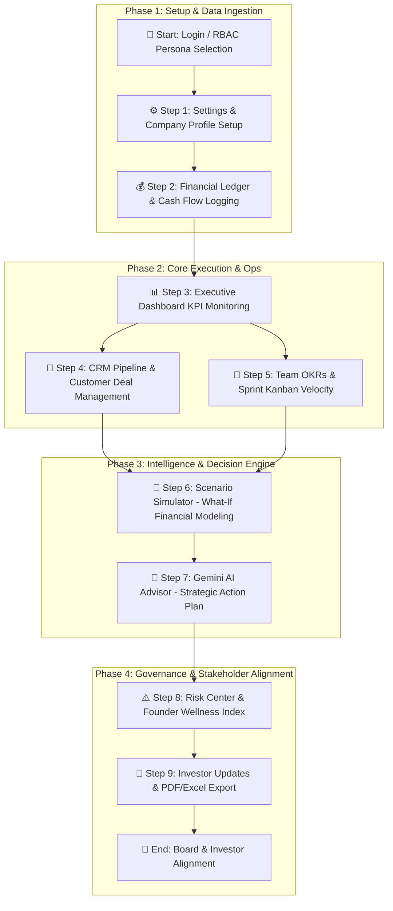

# Nexora 🚀

> **Nexora — Know What’s Next**

Nexora is an all-in-one startup decision engine and operating platform built to help founders, executives, and investors make data-driven strategic decisions. By uniting financial monitoring, customer pipeline tracking, team execution, operational risk assessment, scenario modeling, and Gemini AI strategic advisors into a single minimalist dashboard, Nexora eliminates fragmented spreadsheet models and gives startup leaders total clarity over their business trajectory.

---

## 🔄 How to Use Nexora: End-to-End Application Flowchart

The following flowchart illustrates the step-by-step workflow for operating Nexora:



### Detailed Flowchart Step-by-Step Guide

1. **🏁 Access & Persona Setup**: Log into FounderOS and set your active role (*Founder*, *Co-Founder*, *Executive*, or *Investor*) in the top navbar.
2. **⚙️ Profile Initialization**: Navigate to `Settings` to input company revenue baselines, target runway goals, and Supabase / cloud database keys.
3. **💰 Cash Flow Ingestion**: Use `Finance & P&L` to add recurring revenue streams, log operational expenses, and observe automatic net burn calculation.
4. **📊 Executive Dashboard Review**: Inspect real-time ARR, MRR, cash runway duration, and revenue vs. expense trajectory charts.
5. **💼 Pipeline & Execution Alignment**: Manage enterprise accounts in `Customer CRM` and assign sprint tasks across `Team & Kanban`.
6. **🔮 What-If Scenario Simulation**: In `Scenario Simulator`, adjust hiring headcounts, marketing budgets, and pricing changes to simulate net cash flow impact before committing capital.
7. **🤖 AI Strategic Briefing**: Generate real-time strategic advice using `AI Business Advisor` powered by Google Gemini to get step-by-step execution playbooks.
8. **⚠️ Risk & Wellness Mitigation**: Track active operational risks in `Risk Center` and balance founder workload via `Founder Health Score`.
9. **📄 Stakeholder Reporting**: Generate board-ready updates in `Investor Metrics` and download formatted PDF or Excel decks in `Reports & Exports`.

---

## 🌟 Key Features & Modules

### 📊 Executive Dashboard
* **Real-time KPI Tracking**: Instant visibility into Annual Recurring Revenue (ARR), Monthly Recurring Revenue (MRR), Monthly Net Burn Rate, Runway in Months, and Startup Health Score.
* **Trajectory Visualization**: Interactive revenue vs. expense historical trend lines powered by `recharts`.
* **Sector Distribution & Task Velocity**: Breakdown of customer accounts by industry and team task completion velocity.

### 🤖 AI Strategy Advisor
* **Gemini-Powered Intelligence**: Integrates Google Gemini (`@google/genai`) to synthesize live database state and deliver actionable, prioritized startup recommendations.
* **Instant Action Plans**: One-click execution prompts for growth acceleration, burn reduction, enterprise pipeline expansion, and hiring strategy.

### 🔮 Scenario Simulator
* **What-If Financial Modeling**: Model future startup conditions by adjusting hiring count, average employee salary, marketing spend increases, and pricing model changes.
* **Predictive Metrics**: Instantly project modified runway, projected monthly revenue/expenses, and net cash flow impact before committing capital.

### 💰 Financial Engine & Cash Flow
* **Expense & Revenue Ledger**: Full-stack transaction logging with categorization, date filtering, and status tracking.
* **Burn & Runway Projections**: Real-time runway calculations based on cash balances and net burn trajectory.

### 👥 CRM & Customer Pipeline
* **Account Management**: Track key enterprise accounts, deal stages (Lead, Proposal, Closed Won), contract sizes, and churn risk.
* **Industry Analytics**: Sector-by-sector revenue distribution and account growth metrics.

### 🎯 Team OKRs & Execution
* **Kanban Workflows**: Track team tasks across *To Do*, *In Progress*, and *Completed* stages.
* **Team Efficiency Metrics**: Monitor capacity utilization across 50+ team members and assign strategic priorities.

### ⚠️ Operational Risk Center
* **Proactive Risk Identification**: Classify operational, financial, and technical risks by severity (*Critical*, *High*, *Medium*, *Low*).
* **Mitigation Planning**: Define resolution strategies and assign ownership to prevent startup roadblocks.

### 📈 Investor Relations & Cap Table
* **Shareable Updates**: Generate investor-ready updates summarizing monthly progress, runway updates, and key wins.
* **Cap Table Overview**: High-level equity distribution and valuation history.

### 🩺 Founder Health & Burnout Index
* **Founder Wellness Tracking**: Track workload intensity, sleep metrics, stress levels, and work-life balance scores to prevent founder burnout.

### 📄 Export & Reporting
* **PDF & Excel Export**: Download detailed financial, operational, and pipeline reports formatted for board meetings and investor check-ins using `jspdf` and `xlsx`.

### 🔒 Role-Based Access Control (RBAC)
* **Multi-Persona View Switcher**: Dynamically toggle permissions between **Founder**, **Co-Founder**, **Executive**, and **Investor** roles to test feature visibility and access levels.

### 🎨 Minimalist Design & Dark/Light Mode
* **Clean UI Archetype**: High-density typography, subtle borders, high contrast ratios, and seamless light/dark theme toggling.

---

## 🛠️ Technology Stack

* **Frontend Framework**: [React 19](https://react.dev/) + [TypeScript](https://www.typescriptlang.org/)
* **Build Tooling**: [Vite](https://vitejs.dev/) + [esbuild](https://esbuild.github.io/)
* **Styling & UI**: [Tailwind CSS v4](https://tailwindcss.com/) + [Lucide React Icons](https://lucide.dev/) + [Motion](https://motion.dev/)
* **Charts & Visualizations**: [Recharts](https://recharts.org/)
* **Backend Runtime**: [Node.js](https://nodejs.org/) + [Express](https://expressjs.com/)
* **Database & Persistence**: Server-side JSON Database Engine (`.data/db.json`) with auto-seeding & [Supabase Client](https://supabase.com/) support
* **AI Engine**: Server-Side [Google Gemini API](https://ai.google.dev/) via `@google/genai`
* **Data Export**: `jspdf` & `xlsx`

---

## 📂 Project Structure

```text
├── server.ts                  # Express server entry point & API route proxy
├── server/
│   ├── db.ts                  # Persistent file-backed JSON database engine
│   ├── seed.ts                # Auto-seeding script with realistic startup data
│   └── gemini.ts              # Gemini API integration service
├── src/
│   ├── main.tsx               # Client entry point
│   ├── App.tsx                # Main App shell, navigation routing, & footer
│   ├── index.css              # Tailwind CSS imports & theme styling
│   ├── types.ts               # Shared TypeScript interfaces & types
│   ├── context/
│   │   └── AppContext.tsx     # Global React Context provider for state management
│   ├── services/
│   │   └── api.ts             # API client methods fetching Express backend routes
│   ├── components/
│   │   ├── Navbar.tsx         # Sticky header with role switcher, search, theme toggle
│   │   └── Sidebar.tsx        # Navigation sidebar organized by categories
│   └── views/
│       ├── DashboardView.tsx           # Executive Overview & Core KPIs
│       ├── AIAdvisorView.tsx           # Gemini AI Strategic Recommendations
│       ├── ScenarioSimulatorView.tsx   # What-If Financial & Growth Simulator
│       ├── FinanceView.tsx             # Revenue, Expenses, & Runway Engine
│       ├── CRMView.tsx                 # Pipeline, Deal Stages, & Customer Accounts
│       ├── TeamView.tsx                # OKRs, Kanban Tasks, & Team Efficiency
│       ├── RiskCenterView.tsx          # Risk Register & Mitigation Tracking
│       ├── InvestorView.tsx            # Investor Updates & Cap Table Overview
│       ├── FounderHealthView.tsx       # Wellness Index & Burnout Prevention
│       ├── ReportsView.tsx             # PDF/Excel Export Center
│       ├── SettingsView.tsx            # Company Profile & Integrations Config
│       ├── NotificationsView.tsx       # System Alerts & Audit Logs
│       ├── AdminView.tsx               # Database Management & System Reset
│       └── LoginView.tsx               # Authentication Screen
├── metadata.json              # Applet metadata configuration
├── package.json               # Package manifests & scripts
└── tsconfig.json              # TypeScript configuration
```

---

## ⚡ Getting Started

### Prerequisites

* **Node.js**: v18.0.0 or higher
* **npm**: v9.0.0 or higher
* **Google Gemini API Key** *(Optional for AI Advisor features)*

---

### Installation & Setup

1. **Clone the repository or open the project environment**:
   ```bash
   git clone https://github.com/your-username/founderos.git
   cd founderos
   ```

2. **Install dependencies**:
   ```bash
   npm install
   ```

3. **Configure Environment Variables**:
   Create a `.env` file in the root directory (or use `.env.example` as a template):
   ```env
   # Server-side Gemini API Key for AI Strategy Advisor
   GEMINI_API_KEY=your_gemini_api_key_here
   ```

4. **Start the Development Server**:
   ```bash
   npm run dev
   ```
   The application will start at `http://localhost:3000`.

---

## 🚀 Scripts & Deployment

| Command | Description |
| :--- | :--- |
| `npm run dev` | Starts the Express server with `tsx` and mounts Vite development middleware on port 3000. |
| `npm run build` | Bundles the React frontend with Vite and compiles `server.ts` into a CommonJS server (`dist/server.cjs`) via `esbuild`. |
| `npm run start` | Launches the compiled standalone backend server (`node dist/server.cjs`). |
| `npm run lint` | Runs TypeScript type checking (`tsc --noEmit`). |
| `npm run clean` | Removes built artifacts in `dist/`. |

---

## 📡 API Reference

The backend Express server (`server.ts`) exposes full-stack REST API endpoints:

* **GET `/api/db`**: Retrieves full database state.
* **POST `/api/db/:table`**: Adds a record to the specified table.
* **PUT `/api/db/:table/:id`**: Updates an existing record by ID.
* **DELETE `/api/db/:table/:id`**: Removes a record by ID.
* **POST `/api/simulate`**: Executes a what-if financial scenario calculation.
* **POST `/api/ai/advise`**: Generates real-time AI strategic guidance using Gemini.
* **POST `/api/db/reset`**: Resets the database to initial seed state.

---

## 📄 License

This project is licensed under the MIT License - see the `LICENSE` file for details.
